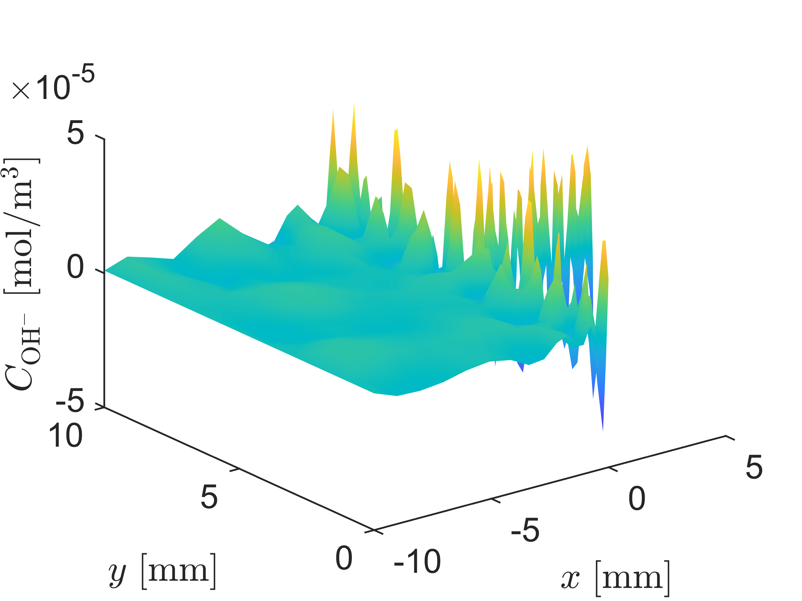
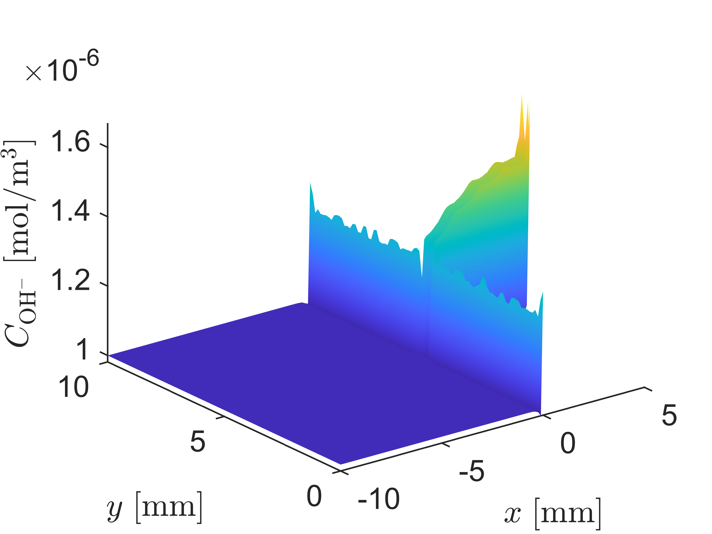

# Lumped Electrochemistry

Non-Lumped             |  Lumped
:-------------------------:|:-------------------------:
  |  

If this code is used, please cite "T. Hageman, E. Martinez-Paneda, Stabilising Effects of Lumped Integration Schemes for the Simulation of Metal-Electrolyte Reactions. Journal of The Electrochemical Society (2023), [10.1149/1945-7111/acb971](http://doi.org/10.1149/1945-7111/acb971) "

Matlab code performing the finite element simulation of a metal domain interacting with an electrolyte, and demonstrates the beneficial effects of lumped integration. This code uses a finite-element scheme to discretise the domain, while using a mix of Gauss integration and lumped integration to retain a stable, well-converging, and oscillation-free solution. More detailed documentation is provided [here](Documentation/main.pdf).

 
